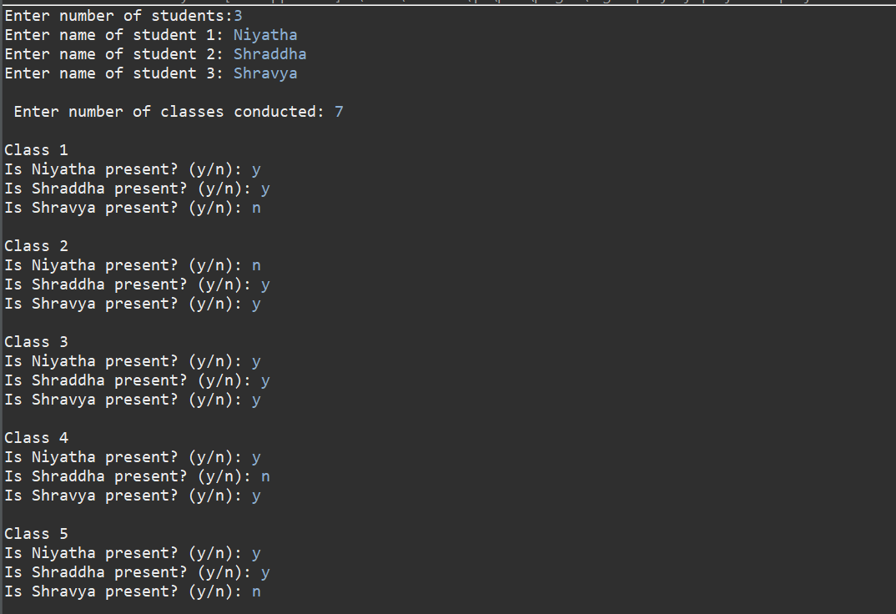
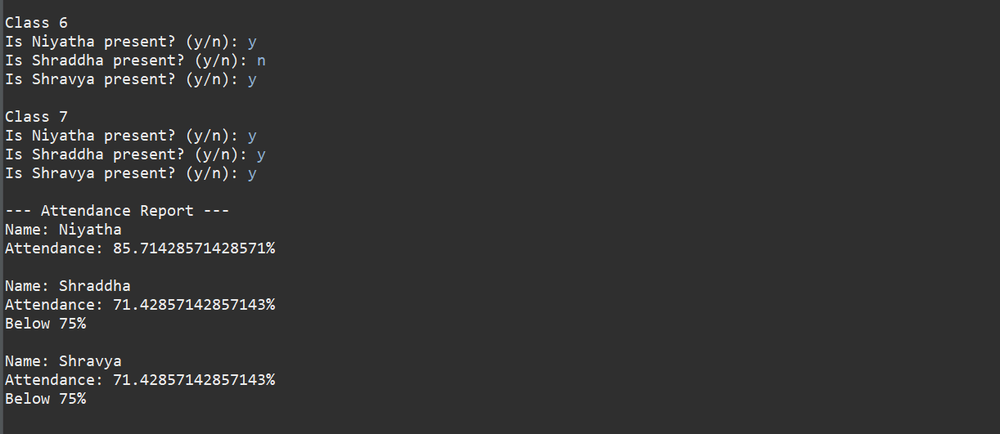

# Student Attendance Tracker System

## Problem Statement

Build a Java-based system to track student attendance and generate reports.

## Features

* Add student details dynamically
* Mark attendance (Present/Absent)
* Calculate attendance percentage
* Display students below 75%
* Simple and user-friendly console interface

---

## Technologies Used

* Java
* OOP Concepts
* ArrayList
* Loops & Conditional Statements

---

##  How to Run

1. Open Eclipse IDE
2. Create a Java Project
3. Add `AttendanceSystem.java`
4. Run as **Java Application**

---

## Output Screenshots

  

---
